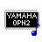

# OPN2BankEditor


A small cross-platform editor of the OPN2 FM chip (which is widely used in Sega Genesis (aka Mega Drive) game console)

# CI Build status
Linux | Windows (32-bit) | macOS
------------ | ------------- | -------------
[](https://travis-ci.org/Wohlstand/OPN2BankEditor) | [](https://ci.appveyor.com/project/Wohlstand/opn2bankeditor) | [](https://travis-ci.org/Wohlstand/OPN2BankEditor)

**BETA. Please report me any bugs and imperfections you have found**

## Download
* **Stable builds:** https://github.com/Wohlstand/OPN2BankEditor/releases
* **Fresh dev builds:**
  * [Download for Windows x86_64](http://wohlsoft.ru/docs/_laboratory/_Builds/win32/opn2-bank-editor/opn2-bank-editor-dev-win64.zip) (built by [AppVeyor](https://ci.appveyor.com/project/Wohlstand/opn2bankeditor))
  * [Download for Windows x86](http://wohlsoft.ru/docs/_laboratory/_Builds/win32/opn2-bank-editor/opn2-bank-editor-dev-win32.zip) (built by [AppVeyor](https://ci.appveyor.com/project/Wohlstand/opn2bankeditor))
  * [Download for macOS x64 (DMG)](http://wohlsoft.ru/docs/_laboratory/_Builds/macosx/opn2-bank-editor/opn2_bank_editor-macos.dmg) (built by [Travis-CI](https://travis-ci.org/Wohlstand/OPN2BankEditor))
  * [Download for macOS x64 (ZIP)](http://wohlsoft.ru/docs/_laboratory/_Builds/macosx/opn2-bank-editor/opn2_bank_editor-macos.zip) (built by [Travis-CI](https://travis-ci.org/Wohlstand/OPN2BankEditor))
  * CIs for other operating systems are coming soon... (However, it's easy to build it by yourself :wink:)

# How to build
You need a Qt 5 to build this project.

Run next commands from project directory:
```
qmake CONFIG+=release CONFIG-=debug FMBankEdit.pro
make -j 4
```

As alternate way you can open FMBankEdit.pro in the Qt Creator and build it.

# Folders
* ***Bank_Examples*** - example bank files which you can edit and preview them
* ***src*** - source code of this tool
* ***_Misc*** - Various stuff (test scripts, dummy banks, documents, etc.) which was been used in development of this tool

