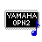

# OPN2BankEditor


A small cross-platform editor for the OPN family of FM synthesis soundchips (which were widely used in Sega Genesis (aka Mega Drive) game console), Fujitsu FM Towns home computer and NEC PC-88 and PC-98 home computer series).

# CI Build status
Linux | Windows | macOS
------------ | ------------- | -------------
[](https://github.com/Wohlstand/OPN2BankEditor/actions/workflows/ubuntu-ci.yml) | [](https://github.com/Wohlstand/OPN2BankEditor/actions/workflows/windows-ci.yml) | [](https://github.com/Wohlstand/OPN2BankEditor/actions/workflows/macos-ci.yml)

**BETA. Please report me any bugs and imperfections you have found**

## Download
* **Stable builds:** https://github.com/Wohlstand/OPN2BankEditor/releases
* **Fresh dev auto-builds:**
  * **Windows**:
    * [Download for Windows x86_64 (7/8/8.1/10 with OPN2/OPNA emulators)](https://wohlsoft.ru/docs/_laboratory/_Builds/win32/opn2-bank-editor/opn2-bank-editor-dev-win64.zip) (built by [GitHub Actions](https://github.com/Wohlstand/OPN2BankEditor/actions/workflows/windows-ci.yml))
    * [Download for Windows x86 (XP/Vista/7/8/8.1/10 with OPN2/OPNA emulators)](https://wohlsoft.ru/docs/_laboratory/_Builds/win32/opn2-bank-editor/opn2-bank-editor-dev-win32.zip) (built by [GitHub Actions](https://github.com/Wohlstand/OPN2BankEditor/actions/workflows/windows-ci.yml))
  * **macOS**:
    * [Download for macOS x64 (DMG)](https://wohlsoft.ru/docs/_laboratory/_Builds/macosx/opn2-bank-editor/opn2-bank-editor-x86_64-master.dmg) (built by [GitHub Actions](https://github.com/Wohlstand/OPN2BankEditor/actions/workflows/macos-ci.yml))
    * [Download for macOS x64 (ZIP)](https://wohlsoft.ru/docs/_laboratory/_Builds/macosx/opn2-bank-editor/opn2-bank-editor-x86_64-master.zip) (built by [GitHub Actions](https://github.com/Wohlstand/OPN2BankEditor/actions/workflows/macos-ci.yml))
    * [Download for macOS ARM64 (DMG)](https://wohlsoft.ru/docs/_laboratory/_Builds/macosx/opn2-bank-editor/opn2-bank-editor-arm64-master.dmg) (built by [GitHub Actions](https://github.com/Wohlstand/OPN2BankEditor/actions/workflows/macos-ci.yml))
    * [Download for macOS ARM64 (ZIP)](https://wohlsoft.ru/docs/_laboratory/_Builds/macosx/opn2-bank-editor/opn2-bank-editor-arm64-master.zip) (built by [GitHub Actions](https://github.com/Wohlstand/OPN2BankEditor/actions/workflows/macos-ci.yml))
  * **Ubuntu**:
    * [Download for Ubuntu 24.04 for Qt5 x64 (DEB)](https://builds.wohlsoft.ru/ubuntu-24-04/opn2-bank-editor-qt5-ubuntu-24-04-amd64-master.deb) (built by [GitHub Actions](https://github.com/Wohlstand/OPN2BankEditor/actions/workflows/ubuntu-ci.yml))
    * [Download for Ubuntu 24.04 for Qt6 x64 (DEB) (Plots unsupported)](https://builds.wohlsoft.ru/ubuntu-24-04/opn2-bank-editor-qt6-ubuntu-24-04-amd64-master.deb) (built by [GitHub Actions](https://github.com/Wohlstand/OPN2BankEditor/actions/workflows/ubuntu-ci.yml))
    * [Download for Ubuntu 22.04 x64 (DEB)](https://builds.wohlsoft.ru/ubuntu-22-04/opn2-bank-editor-ubuntu-22-04-amd64-master.deb) (built by [GitHub Actions](https://github.com/Wohlstand/OPN2BankEditor/actions/workflows/ubuntu-ci.yml))
    * [Download for Ubuntu 20.04 x64 (DEB)](https://builds.wohlsoft.ru/ubuntu-20-04/opn2-bank-editor-ubuntu-20-04-amd64-master.deb) (built by [GitHub Actions](https://github.com/Wohlstand/OPN2BankEditor/actions/workflows/ubuntu-ci.yml))
    * [Download for Ubuntu 18.04 x64 (DEB)](https://builds.wohlsoft.ru/ubuntu-18-04/opn2-bank-editor-ubuntu-18-04-amd64-master.deb) (built by [GitHub Actions](https://github.com/Wohlstand/OPN2BankEditor/actions/workflows/ubuntu-ci.yml))
    * [Download for Ubuntu 16.04 x64 (DEB)](https://builds.wohlsoft.ru/ubuntu-16-04/opn2-bank-editor-ubuntu-16-04-amd64-master.deb) (built by [GitHub Actions](https://github.com/Wohlstand/OPN2BankEditor/actions/workflows/ubuntu-ci.yml))
    * [Download for Ubuntu 14.04 x64 (DEB) (Plots unsupported)](https://builds.wohlsoft.ru/ubuntu-14-04/opn2-bank-editor-ubuntu-14-04-amd64-master.deb) (built by [GitHub Actions](https://github.com/Wohlstand/OPN2BankEditor/actions/workflows/ubuntu-ci.yml))

# How to build
**Prerequisites**

This editor requires following dependences on Linux-based systems.
Debian and it's derivatives:
```
build-essentials
libasound2-dev
zlib1g-dev
cmake
qt5-default
qttools5-dev
libpulse-dev
libqwt-qt5-dev //OPTIONAL
libjack-dev //OPTIONAL
```
Arch and it's derivatives:
```
desktop-file-utils
hicolor-icon-theme
jack
libpulse
qwt
cmake
qt5-base
qt5-tools
```
Before you start the build, make sure you have also cloned submodules!

```
git submodule init
git submodule update
```
**Building with CMake**

Navigate to the project directory in a terminal and follow this build procedure.

```
mkdir build
cd build
cmake -DCMAKE_BUILD_TYPE=Release -DCMAKE_INSTALL_PREFIX=/usr/local ..
make
sudo make install
```

This will result in a software installation located in /usr/local, with program shortcuts, icons and MIME type associations.

**Building with QMake**

The easiest way is to open FMBankEdit.pro in the QtCreator software and run a compilation. Alternatively, you can also build manually on the command line.

Navigate to the project directory in a terminal and follow this build procedure.

```
qmake CONFIG+=release CONFIG-=debug FMBankEdit.pro
make
```
As alternate way you can open FMBankEdit.pro in the Qt Creator and build it.

## Languages

As of version 1.3.1, this tool supports following languages:

* English
* Français (French)
* Русский (Russian)
* Polski (Polish)

# Folders
* ***Bank_Examples*** - example bank files which you can edit and preview them
* ***Specifications*** - documentation of file formats used by this tool
* ***cmake*** - CMake-related scripts
* ***src*** - source code of this tool
* ***_Misc*** - Various stuff (test scripts, dummy banks, documents, etc.) which was been used in development of this tool
